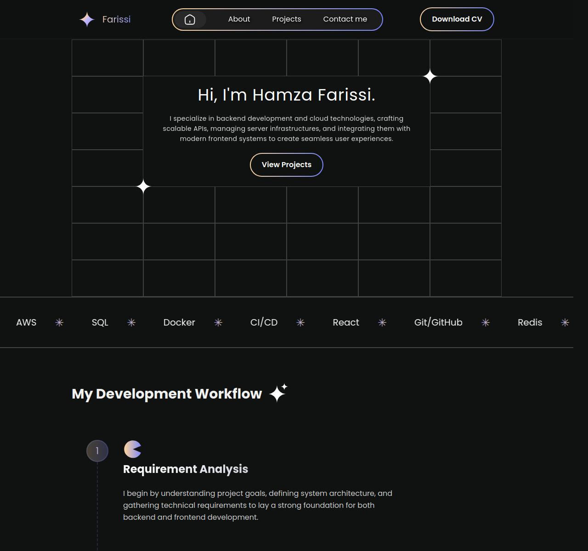

# Personal Portfolio Website

A modern, responsive portfolio website built with React, Vite, and TailwindCSS, featuring a sleek dark theme and interactive elements.



## ✨ Features

- 🎯 Responsive design that works on all devices
- 🌙 Dark theme with gradient accents
- 🎨 Smooth animations using Framer Motion
- 📱 Interactive project showcases with image sliders
- 🔄 Dynamic tech stack visualization
- 📝 Contact form with Netlify Forms integration
- 🚀 Optimized performance and loading times

## 🛠️ Tech Stack

- [React](https://reactjs.org/) - Frontend library
- [Vite](https://vitejs.dev/) - Build tool
- [TailwindCSS](https://tailwindcss.com/) - Styling
- [Framer Motion](https://www.framer.com/motion/) - Animations
- [React Icons](https://react-icons.github.io/react-icons/) - Icons
- [Netlify](https://www.netlify.com/) - Hosting & Form handling

## 🚀 Getting Started

1. Clone the repository:

```bash
git clone https://github.com/roxxe3/Portfolio-2.0
```

2. Navigate to the project directory:

```bash
cd portfolio
```

3. Install the dependencies:

```bash
npm install
```

4. Run the development server:

```bash
npm run dev
```

5. Open your browser and visit `http://localhost:3000` to see the website.

## 📦 Building for Production

To create an optimized production build, run:

```bash
npm run build
```

The output will be in the `dist` directory. You can then deploy the contents of this directory to your preferred hosting service.

## 📄 License

This project is licensed under the MIT License. See the [LICENSE](LICENSE) file for details.

## 🙏 Acknowledgements

- Inspired by various portfolio designs and templates available online.
- Special thanks to the open-source community for providing amazing tools and libraries.
